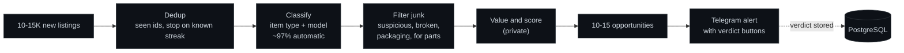
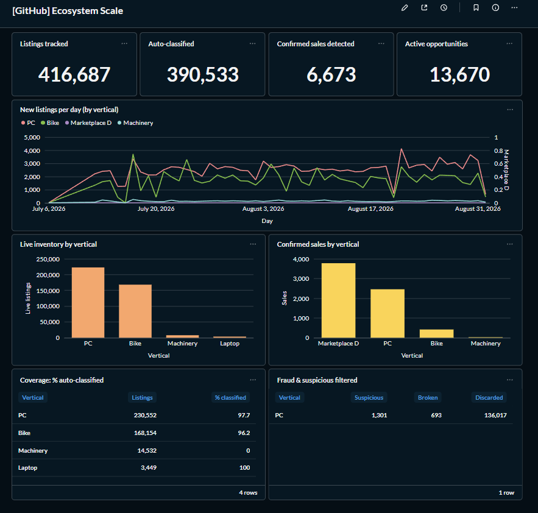
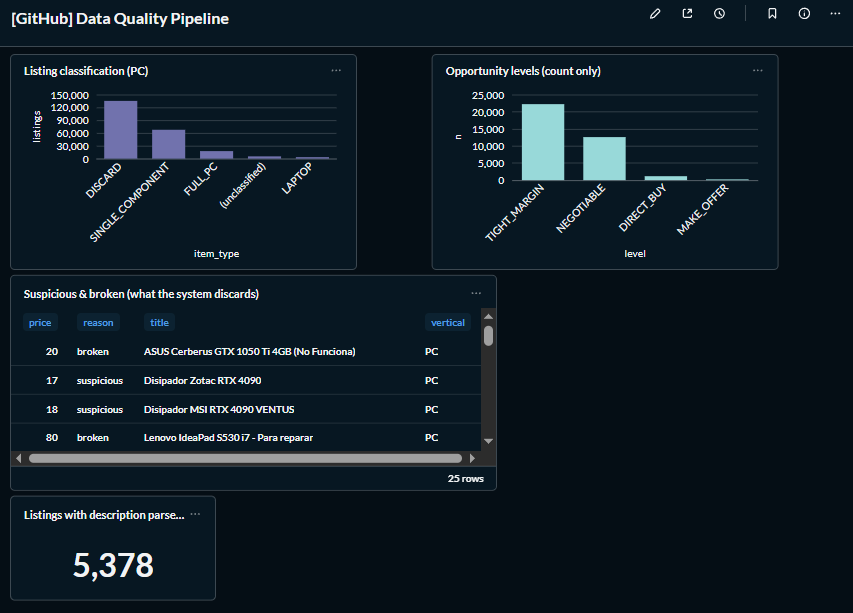
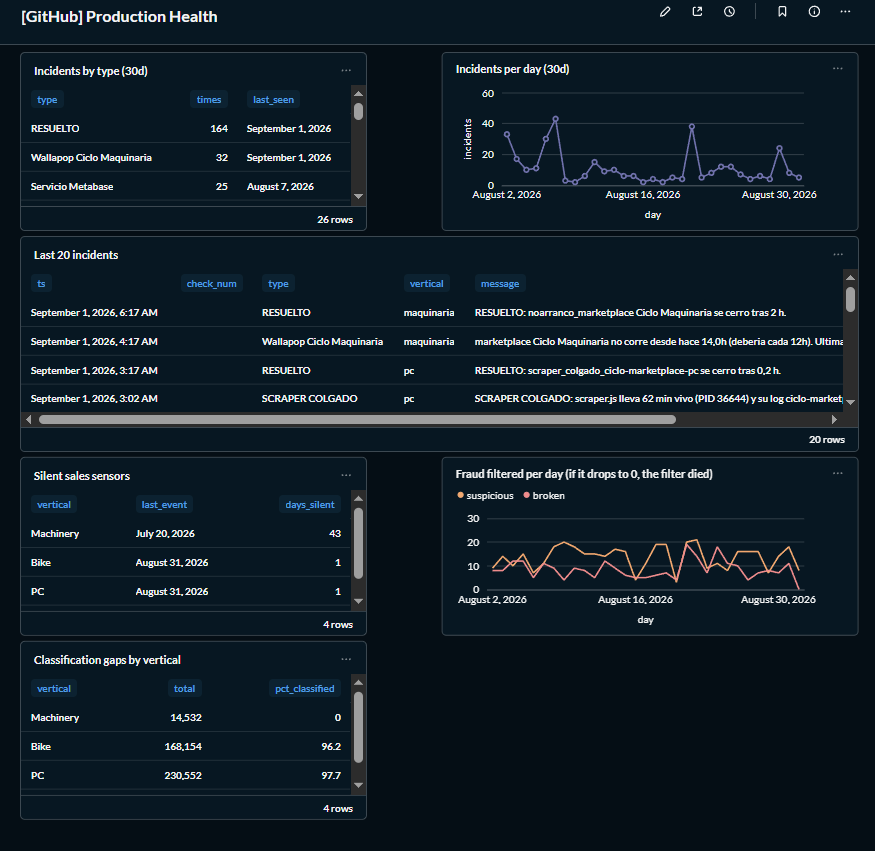
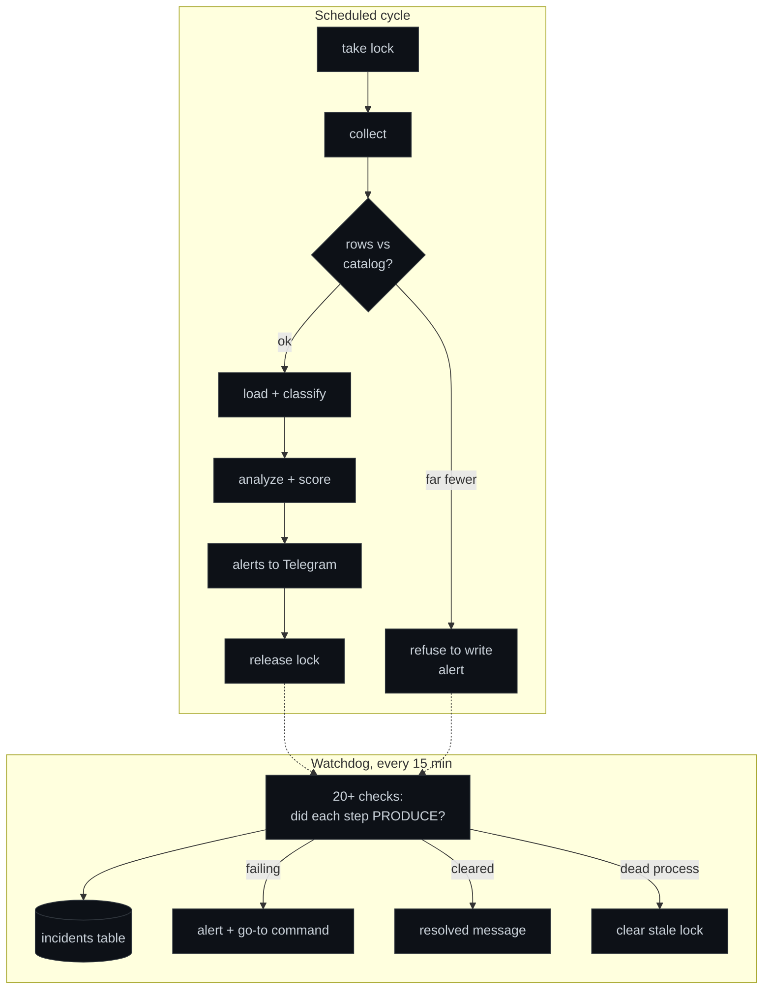

# Market Intelligence Agent

**A production AI agent that turns 10-15K daily marketplace listings into the handful of
profitable opportunities worth acting on.**

I built this to stop reading marketplaces by hand. It collects second-hand listings around
the clock, stores them in PostgreSQL, scores them, and lets me ask questions in plain
language through a local LLM that never touches the database directly. There was no
dataset to start from: every row in the database was collected by this system, from zero. Everything runs on
one server at home. No cloud APIs, no data leaving the machine.

> **Context.** I am self-taught. This is a sanitized extract of a larger system I designed,
> built and operate 24/7 for a family reselling business. The scoring logic, the price
> thresholds, the exact sources and the anti-bot handling are the core of that business and
> are not in this repo. The code here is demo code with fictional data. What I want to show
> is the architecture and how I run it in production.

---

## The problem

The database I have built with these collectors holds 400K+ listings and grows by
10-15K a day across several product categories (PC components, machinery, bikes). Reading that by hand is impossible, and a
fixed set of dashboards cannot answer the questions I actually ask: what is a given part
going for right now, where is it cheapest, how many sold last month, is this listing a
good deal. I needed a funnel with judgment: from 10-15K new listings a day down to the
10-15 worth a look.

## How it works

Three layers, each one feeding the next:

```
  Collectors (Playwright) -> PostgreSQL (ingest -> classify -> value)
  -> Scoring -> LLM agent (Ollama/Qwen, tool calling)
  -> Metabase dashboards + Telegram alerts
```

The funnel, per day:





### 1. Market data capture

One collector per product category, written in Node.js with Playwright. Each one runs on a
schedule, walks the marketplace search results, and appends what it finds to an
accumulated catalog. It keeps a set of ids it has already seen, so each run only processes
new listings and stops early when it hits a streak of known ones.

Two things I had to get right here:

- **Stability under bot detection.** The marketplaces actively detect automated traffic. Keeping the collectors stable was most of the work in this layer. How I do it is private.
- **Never trusting a single run.** A run that returns far fewer listings than the catalog
  already holds is treated as suspicious. The collector refuses to overwrite and raises an
  alert instead. I added this after an empty run silently wiped a large catalog and every
  downstream table with it.

Collectors that hit different sites run in parallel. Collectors that hit the same site run one
at a time.

### 2. Data

PostgreSQL is the source of truth. A loader takes the raw catalog, classifies each listing
(what kind of item it is, which model it is), attaches an estimated value, and upserts it.
The upsert never downgrades a known state: once a listing is marked sold, a later capture
cannot flip it back to available.

I keep the classifier as the only place where classification logic lives. If a rule is
wrong I fix the classifier and backfill the table, never the other way round, because the
next load would overwrite a hand fix.

The scoring step (private) reads that table and flags the listings worth acting on. A
separate process revisits published listings a few days later to detect which ones sold,
which gives me a sold-price signal to compare against asking prices.



### 3. The agent

This is the part I care most about. I run Qwen 2.5 14B locally through Ollama and let it
answer questions over the database. The rule is simple: **the model never writes SQL**.

```
   question ---> agent ---(question + tool schemas)---> local LLM
                   |                                        |
                   |   <---(tool_calls: which tool,  <------+
                   |         which parameters)
                   v
        validate parameters --> run read-only parametrized SQL --> rows
                   |                                                |
                   +-----------(rows back to the model)-----> LLM writes the answer
```

The model gets a catalog of typed tools (`search_listings`, `count`, `median_price`,
`opportunities`). It reads the question and returns which tool to call and with what
arguments. My code validates every argument against a whitelist, runs a hand-written
parametrized query as a read-only database user, and hands the rows back so the model can
write the answer from real data. A comparison between two models triggers two
`median_price` calls and one summary. See [examples/expected_output.md](examples/expected_output.md).

I tried three approaches before settling on this one:

1. A fixed catalog of queries where the model only picks one and extracts parameters. Safe
   but rigid. Every new question needed a new query.
2. Letting the model write SQL, contained by a read-only role. Flexible, but it invented
   columns and figures, and I could not trust the output.
3. Typed tool calling. Same flexibility as option 2, but there is no code path where model
   output becomes a query string. That is why I kept it.

Safety comes from three independent layers, not from the prompt: the model only emits
`{tool, params}`; every query uses bound parameters; the database role cannot write. On top
of that, any argument outside the whitelist is dropped and reported rather than silently
used. The details are in [docs/architecture.md](docs/architecture.md).

### 4. Alerts, watchdog and self-maintenance

The whole thing has to run unattended, so I spent real effort on the operations side.

**Alerts.** Each capture cycle pushes its findings to Telegram: new opportunities as
individual messages with inline buttons so I can mark a verdict from my phone, and a
grouped digest at the end. Those verdicts are stored back in the database.

**Watchdog.** A separate process runs every 15 minutes with 20+ checks. The principle is
that a process being alive tells me nothing; I check that each component **produced its
output**: fresh rows, a regenerated price table, a completed cycle with results, a fraud
filter that still caught something today. Each check knows the real log pattern of the
component it watches, because every collector writes differently and a generic check matches
none of them. I tested the checks against old broken logs, not only against a healthy
system, since zero alerts only proves the absence of false positives.

Every alert carries a "go to" line: the command to run and how to read its output. When a
condition clears, the watchdog sends a resolved message on its own. Every incident is
written to a table, so I can chart failures over time instead of scrolling logs.



**Self-maintenance.** The database, the bots and the dashboards run as OS services with
automatic restart. Cycles take a lock so two runs of the same collector cannot overlap, and
the watchdog clears locks left behind by a dead process. A startup script brings everything
back in order after a reboot or a power cut. Disk cleanup runs daily. A backup to a
separate physical disk runs weekly, and I tested the restore, because an untested backup is
a hope, not a backup.

How a cycle and the watchdog interact:



## Tech stack

JavaScript, TypeScript, Node.js, PostgreSQL, Playwright, Ollama with Qwen 2.5, n8n,
Metabase, Telegram Bot API. One Windows server, one NVIDIA GPU for the local model.

## Running the demo

The code in `src/` runs against fictional in-memory data. The agent needs a local
[Ollama](https://ollama.com) with a model that supports tool calling.

```bash
npm run check                      # syntax-check all modules
node src/monitoring/watchdog.js    # run the health checks against sample input
node examples/ask.js "what's the RTX 4070 going for?"
node examples/ask.js "compare the RTX 4070 and the 4070 Ti"
```

Without Ollama, [examples/expected_output.md](examples/expected_output.md) shows what a run
looks like.

## Repository layout

```
src/agent/       tool-calling loop and whitelist validation
src/tools/       typed tool definitions the model can call
src/db/          schema, example read queries, data-access layer
src/monitoring/  watchdog and health checks
examples/        runnable examples
docs/            architecture notes and dashboard screenshots
```

## What's next

The pipeline is built as a platform: a new market or a new product category means new
collectors and a new classifier, while data, scoring, agent, alerts and watchdog stay the
same. Three things I am working on now:

- **Europe.** Extending the machinery and PC component collectors beyond Spain to other
  European marketplaces, where the same arbitrage exists with a larger inventory.
- **Real estate in Spain.** A new vertical on the same loop (capture, classify, value,
  alert), applied to property listings.
- **A stronger local model.** Moving the agent from a 14B to a 32B model now that the GPU
  has room for it, and measuring whether the extra reasoning is worth the latency.

## Scope

This repo shows the architecture and the patterns. The scoring formulas, the price
thresholds, the data sources, the anti-bot handling and the exact models that carry margin
are private. I am happy to walk through the reasoning behind any of it in a conversation.

## License

MIT. See [LICENSE](LICENSE).
