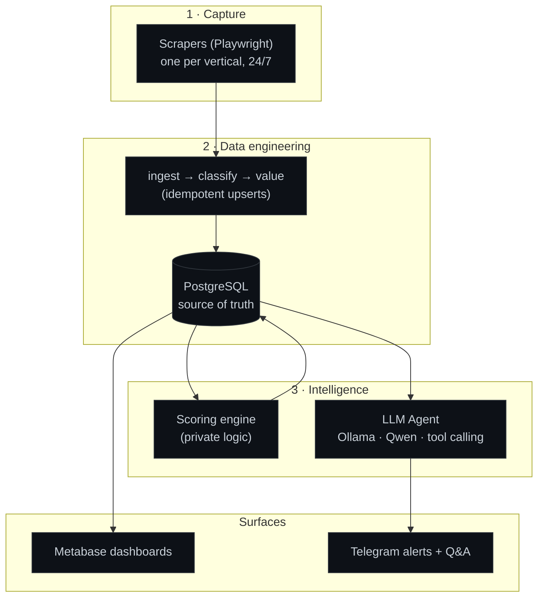

# Architecture

## The three layers

**Layer 1 — capture.** One scraper per vertical runs continuously, deduplicating what it
has already seen and handling the marketplaces' anti-bot defenses so ingestion stays
stable. Concurrency is controlled: scrapers that don't compete for the same resource run
in parallel; those that do run in series.

**Layer 2 — data engineering.** Raw listings land in PostgreSQL, the single source of
truth. A normalization step classifies each row (type, category, detected model) and
attaches an estimated value. Writes are idempotent upserts with rules that never
downgrade a known state (a sold item does not revert to available). A read-only role is
used for all query access.

**Layer 3 — intelligence.** A scoring step (private) flags the listings worth acting on.
On top of the data sits the LLM agent: it answers natural-language questions by calling
typed tools, never by writing SQL. Results surface as Metabase dashboards and as Telegram
alerts and Q&A.

## The agent: why tool calling

Three approaches were built and compared:

| Pattern | How it works | Why it was / wasn't kept |
|---|---|---|
| **A — intent-routed catalog** | A fixed set of parametrized queries; the model only picks one and extracts parameters. | Safe, but rigid — every new question needs a new hand-written query. |
| **B — LLM writes SQL** | The model generates SQL, contained by a read-only DB role. | Flexible, but the model would hallucinate columns and invent figures; hard to trust. |
| **C — typed tool calling** | The model returns `{tool, params}`; code validates and runs the query. | **Kept.** Keeps the flexibility of natural language while making unsafe output structurally impossible. |

The decisive property of C: there is **no code path** where model output becomes a query
string. The model chooses a tool and arguments; the arguments are validated against a
whitelist; the query is hand-written and parametrized. Flexibility and safety stop being
a trade-off.

## Safety model (three layers)

1. **The model never emits SQL** — only `{tool, parameters}`.
2. **Every query is parametrized** (`$1, $2, …`); model values are bound, never
   concatenated.
3. **The database user is read-only** — even a bad query cannot modify data.

On top of that, *the model proposes, the code validates*: enum-like parameters are
checked against the real whitelist of values; anything outside it is dropped and reported
rather than silently changing the result.

## Engineering for production

What separates this from a script:

- **Watchdog that checks output, not liveness.** 20+ checks; each targets the real signal
  of its component and is tested against known-bad historical inputs, because "0 alerts"
  only proves there are no false positives — not that the check works.
- **Anti-wipe guard.** A run returning far fewer rows than the accumulated catalog does
  not overwrite; it preserves the previous data and alerts. (This exists because an empty
  run once overwrote a large catalog silently.)
- **Observability as data.** Every incident is written to a table, so the failure history
  is queryable and charted (see the Production Health dashboard).
- **Tested backups and least privilege.** Backups are restore-tested; the agent runs as a
  read-only role.

## Engineering method

- Diagnose before touching — reproduce the cause before changing anything.
- Deliver → execute → verify — a change without observed output isn't done.
- Hunt silent failures — the ones that don't error but stop producing output.
- Idempotent changes; write down every wrong hypothesis so it's paid for once.
