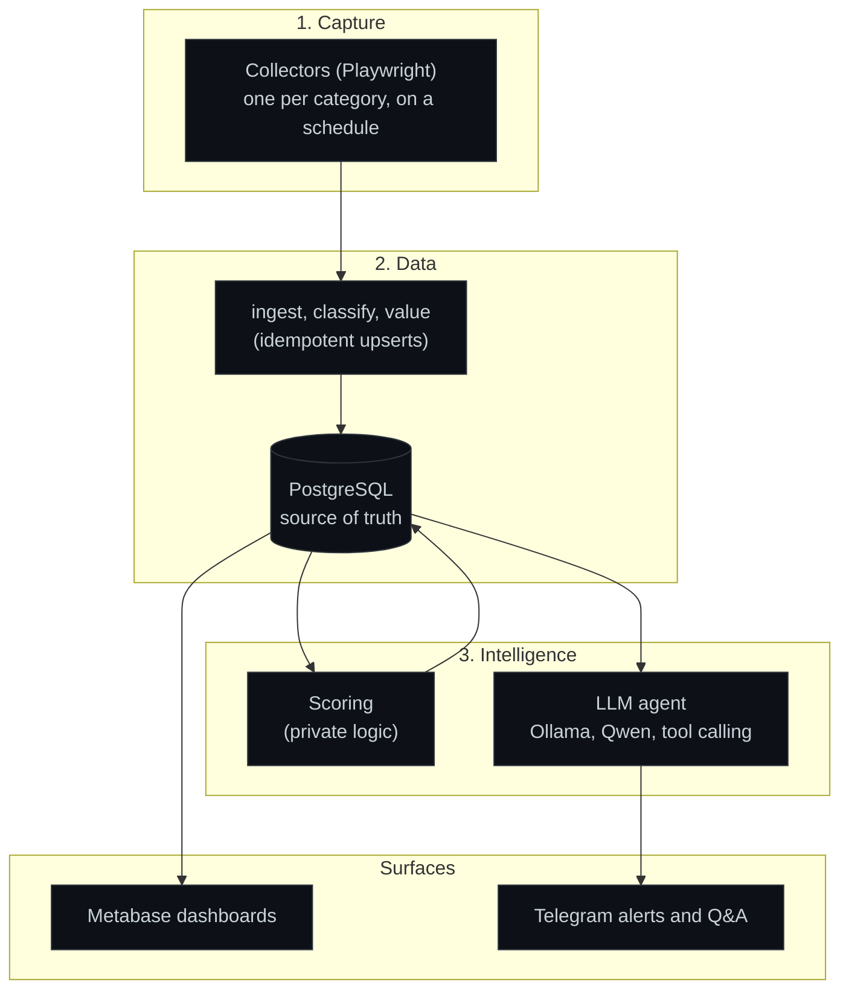
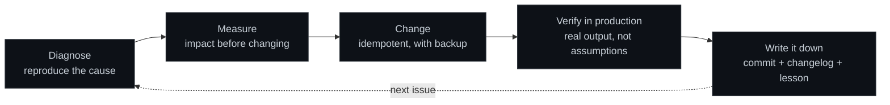

# Architecture

## The three layers

**Capture.** One collector per product category. Each keeps the ids it has already seen and
processes only new listings. A run that returns far fewer rows than the accumulated catalog
is refused and reported instead of written. Collectors for different sites run in parallel;
collectors for the same site run in series.

**Data.** PostgreSQL holds everything. A loader classifies each listing (type, category,
detected model), attaches an estimated value and upserts. Upserts never downgrade a known
state. The classifier is the single place where classification rules live; fixes go there
and then get backfilled, never patched by hand in the table. All query access from the agent
goes through a read-only role.

**Intelligence.** A private scoring step flags the listings worth acting on. The agent sits
on top and answers questions by calling typed tools. Results surface as Metabase dashboards
and Telegram alerts.

## The agent: why tool calling

I built three versions and kept the third.

| Pattern | How it works | Result |
|---|---|---|
| **A. Intent-routed catalog** | A fixed set of parametrized queries. The model picks one and extracts the parameters. | Safe but rigid. Every new question needed a new hand-written query. |
| **B. LLM writes SQL** | The model generates SQL, contained by a read-only DB role. | Flexible, but it invented columns and figures. I could not trust it. |
| **C. Typed tool calling** | The model returns `{tool, params}`. Code validates and runs the query. | **Kept.** Same flexibility as B, and there is no code path where model output becomes a query string. |

The property that decided it: in C, flexibility and safety stop being a trade-off. The model
chooses a tool and arguments, the arguments are checked against a whitelist, and the query
is hand-written and parametrized.

## Safety model

Three independent layers. None of them depends on the prompt.

1. The model never emits SQL, only `{tool, parameters}`.
2. Every query is parametrized (`$1, $2, ...`). Model values are bound, never concatenated.
3. The database role is read-only. A bad query cannot modify data.

On top of that, enum-like parameters (category, platform, item type, status) are checked
against the real list of values. Anything outside it is dropped and reported, so a
hallucinated value cannot silently change the result.

## Running it in production

- **Watchdog that checks output, not liveness.** 20+ checks every 15 minutes. Each one
  targets the real signal of its component and is tested against old broken logs, because
  zero alerts only proves the absence of false positives.
- **Anti-wipe guard.** A run returning far fewer rows than the accumulated catalog does not
  overwrite. It keeps the previous data and alerts. An empty run once wiped a large catalog
  silently; this guard exists because of that.
- **Incidents as data.** Every alert is written to a table, so failures can be charted and
  queried instead of grepped.
- **Tested backups, least privilege.** Weekly backup to a separate physical disk, restore
  tested. The agent runs as a read-only role.
- **Supervised services and clean restarts.** Database, bots and dashboards run as OS
  services with automatic restart. Cycles take a lock to avoid overlapping runs. A startup
  script brings everything back after a reboot.

## How I work

- Diagnose before touching. Reproduce the cause first.
- Deliver, execute, verify. A change without observed output is not done.
- Hunt silent failures, the ones that do not error but stop producing output.
- Keep changes idempotent. Write down every wrong hypothesis so it is paid for once.
